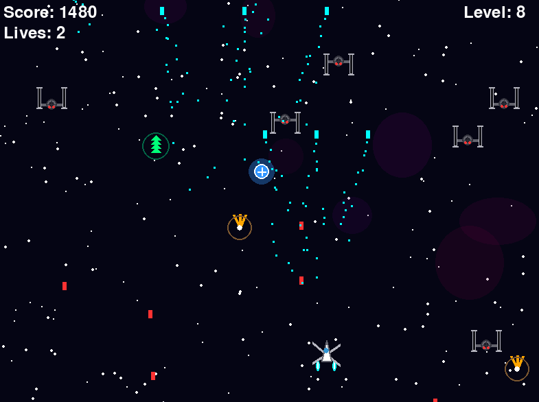
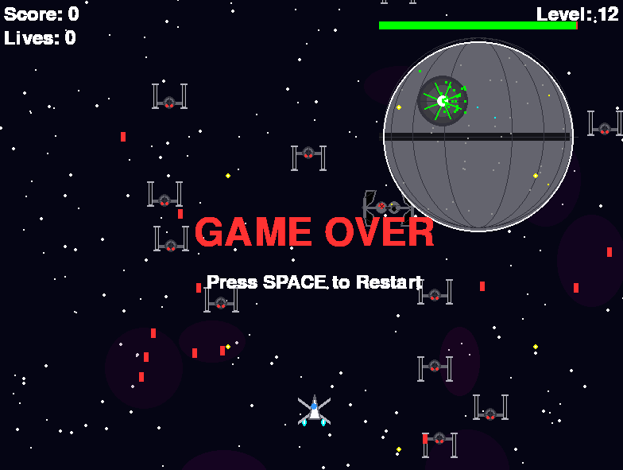
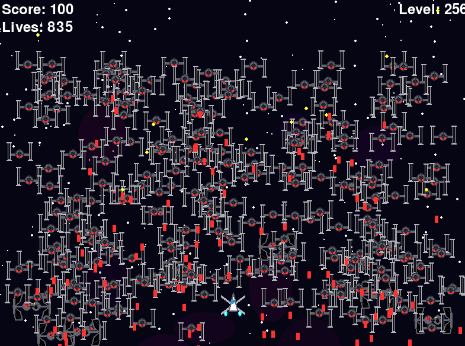

# star-wars-galaga

## Description
A game that implements features from Galaga but also adds a Star Wars theme. Developed by using AI (Google Gemini and ChatGPT).

## Details
Level details:
Levels get more difficult as the game progresses because more enemies will spawn and the bosses will have more health. A boss will appear every three levels. First the player will encounter the star destroyer boss, then the big star destroyer boss, and finally the death star. The player will know when they reach the next level when a hyperspace animation is played.
For non-boss levels:
The enemies do not need to be destroyed in order to advance to the next level however destroying all enemies is one way to make it to the next level. Another way to make it to the next level is to dodge all the attacks from the enemies and wait for them to reach the bottom of the screen and exit the screen. 
For boss levels:
The same thing must happen for non-boss levels except the boss must be defeated. A healthbar on top of the boss displays its health.

Enemy details:
The game has enemies that rain down from the top of the screen to the bottom. The enemys can shoot projectiles. Hitting a projectile or the enemy will cost the player one life. There are two types of non-boss enemies. A normal TIE fighter and a bomb TIE fighter. The normal TIE fighter shoots regular red projectiles and looks like a regular TIE fighter. The bomb TIE fighter shoots a main projectile that explodes into smaller yellow projectiles. Each non-boss enemy only takes one hit to kill. There are three boss enemies: a star destroyer, a big star destroyer, and the death star. They are meant to challenge the player. 

Powerups:
A player must collide with a powerup to collect it. There are four powerups. The green powerup grants increased speed. The blue powerup with the plus sign grants an extra life. The blue powerup without the plus sign grants the player the ability to shoot two projectiles at once. The yellow/orange powerup grants the player the ability to shoot three projectiles at once. 

Player details:
When the player loses all their lives, it is game over. To restart, press the space bar.

The player can increase their score by defeating enemies.

## Controls
Use the left and right arrow keys to move or use A and D keys. Press space bar to fire projectiles and to restart if it is game over.

## How to run
Make sure that python and pygame is installed. Usually pygame is installed through the terminal. Once these are both installed, run the game script through the terminal.

## Cheats
If you ever want to cheat then modify line 959 in the game file.
score, level, player_lives, game_active = 0, 1, 3, True

